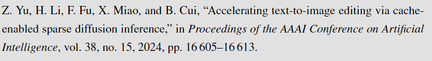
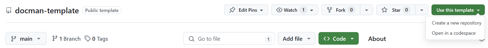
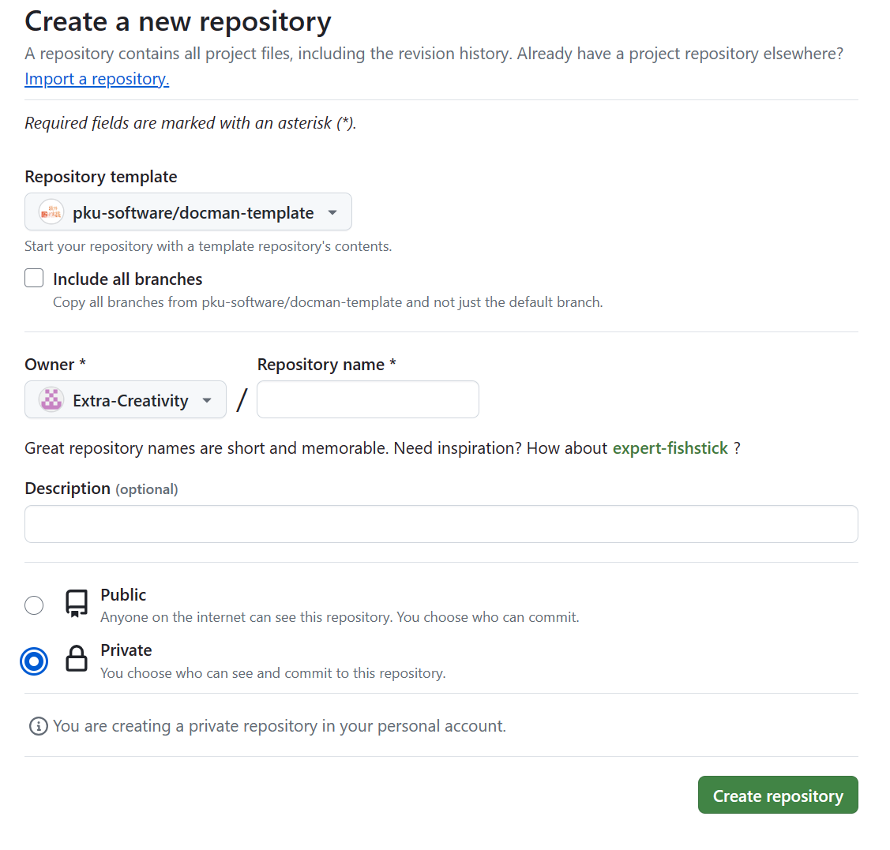
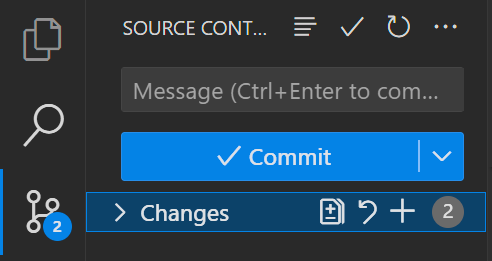
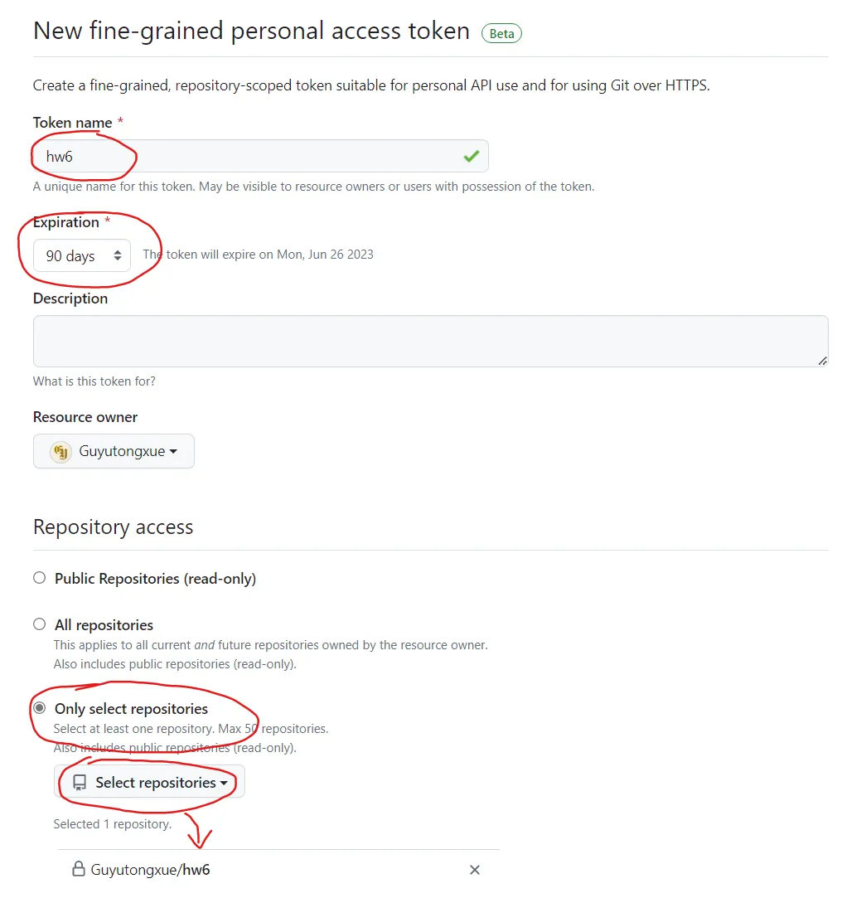
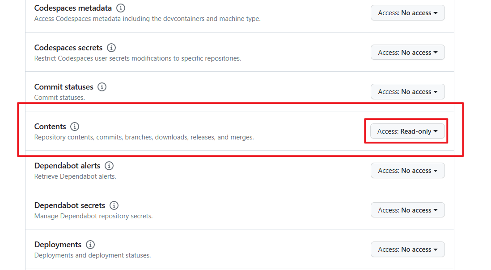
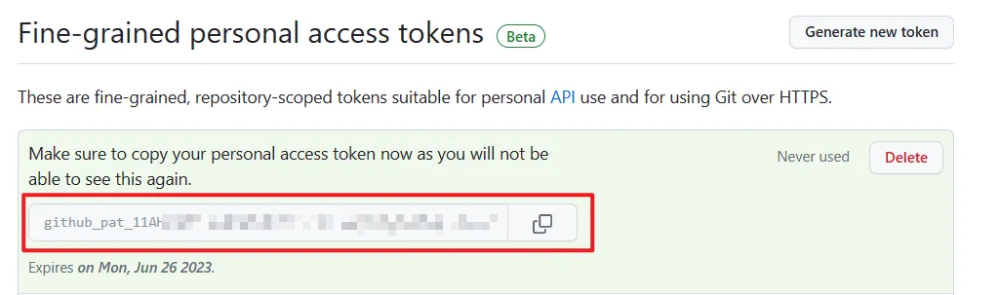

# 中作业文档

在前半学期的课程中，我们渗透了软件设计的原则，如健壮性、可扩展性等；各位同学也学习了很多 C++ 的知识，并完成了助教们布置的各种坑人作业。然而，同学们总是在补全一些短的代码片段，并不需要也不能将我们学习到的原则应用到编码过程中，只是在练习语言本身。<del>想必同学们一定已经摩拳擦掌，跃跃欲试，想要编写一个比较像软件的应用了！</del>

在中作业中，我们将完成一个简单的文献管理程序。考虑到作业量，本次作业会采用比较简单的命令行式的交互。我们希望你能在这个过程中综合运用学过的知识，进行一定的练习，也算为大作业做一定的准备。

## 背景简介

在一些技术博客、论文、甚至于书籍的写作中，通常需要引用其他的材料，用以简化说明或者佐证观点。在一些排版软件中（例如大家将来写论文可能用到的 $\mathrm\LaTeX$），就是将可能需要的文献组织到一起，例如：

```tex
%% Reference.bib
@inproceedings{yu2024accelerating, %% 这里是代称，下面是信息
  title={Accelerating Text-to-Image Editing via Cache-Enabled Sparse Diffusion Inference},
  author={Yu, Zihao and Li, Haoyang and Fu, Fangcheng and Miao, Xupeng and Cui, Bin},
  booktitle={Proceedings of the AAAI Conference on Artificial Intelligence},
  volume={38},
  number={15},
  pages={16605--16613},
  year={2024}
}
```

在行文中，我们只需要使用 `\cite{yu2024accelerating}` 替代，排版中就会在文章最后出现如下格式：



我们的程序也希望你可以拿到一个所有文献的合集文件后，将文章中使用的文献全部列在最后。不过，我们还要增强其功能，让程序通过网络查询到的信息来补充文献的更多信息。

## 程序要求与示例

### 简介

我们使用的文献合集的文件的格式为 JSON，具体什么是 JSON 和如何在 C++ 中使用请先查看[最后的附录](#JSON)。给定如下的 json：

```c++
{
  "version": 1,
  "citations": [
    {
      "id": "1",
      "type": "book",
      "isbn": "9780134092669"
    },
    {
      "id": "2",
      "type": "webpage",
      "url": "https://pytorch.org"
    },
    {
      "id": "3",
      "type": "article",
      "title": "A Fast File System for UNIX",
      "author": "Marshall Kirk McKusick, William N. Joy, Samuel J. Leffler, Robert S. Fabry",
      "journal": "ACM Transactions on Computer Systems",
      "year": 1984,
      "volume": 2,
      "issue": 3
    }
  ]
}
```

给定文章：

```
The book [1] is a great book. The article [3] is also a classic. View [2] for more info.
```

我们希望你的程序可以按照如下方式输出，即增加一个引用列表，并附带必要的相关信息：

```
The book [1] is a great book. The article [3] is also a classic. View [2] for more info.

References:
[1] book: Randal E. Bryant, David R. O'Hallaron, Computer Systems: A Programmer's Perspective, Pearson, 2019
[2] webpage: PyTorch. Available at https://pytorch.org
[3] article: Marshall Kirk McKusick, William N. Joy, Samuel J. Leffler, Robert S. Fabry, A Fast File System for UNIX, ACM Transactions on Computer Systems, 1984, 2, 3
```

### 详细要求

> 你首先需要从 Github 上将代码克隆下来，我们在附录中也介绍了 [Git](#Git) 的使用方法。

每个文献都具有一个数字 `id`，它在文章中使用 `[id]` 来进行引用。我们需要找到文章中所有的 `id`，并按照 `id` 顺序在文末对文献进行排列。在文献合集中，所有的文献都在 `citations` 的数组中，每个对象代表了一个文献，并具有字符串形式的 `id`。我们保证所有的 `id` 是无重复的。

我们要求处理的文献有三类：

+ 书籍，在文献合集中对象的字段 `type` 为 `"book"`，只具有`ISBN`号，需要程序从网络上查询合适的额外信息，最终的输出格式为 `[id] book: 作者, 书籍标题, 出版社, 出版年份`。
+ 网页，在文献合集中对象的字段 `type` 为 `"webpage"`，只具有网址，同样需要程序从网络上查询，最终的输出格式为 `[id] article: 作者, 文章标题, 期刊名, 发表年份, 卷号, 期号`。
+ 文章在文献合集中对象的字段 `type` 为 `"article"`，对象的内容包含了它的全部信息，最终的输出格式为 `[id] webpage: 网页标题. Available at 网址`。

对于网络进行查询的接口如何使用请详见[附录](#HTTP)。我们期望你补充的内容包括：

+ 命令行的交互功能，我们只给出了非常简易的版本，你需要将它的功能扩充到能够应对各种可能的输入。

+ 所有带有 `FIXME` 标注的内容，表示该函数尚未写完。所有 FIXME 均带有注释，说明了需要补充的功能
+ `Citation` 类及其子类，用于表示文献的信息，请考虑如何尽量避免代码冗余
+ 从网络获取信息的函数（写在对应的子类中），请注意异常处理

同时，我们在 `utils.hpp` 中为大家提供了一些工具函数。`readFromFile` 可以将文件内容读取到一个 `string` 中并返回，`encodeUriComponent` 的作用见[附录HTTP部分](#HTTP)。

最终，假设编译得到的可执行程序为`docman`，我们期望你的程序通过命令行进行处理：

```c++
./docman OPTIONS input_file
```

其中`input_file`为输入的文章路径（如果仅为一个`-`，则从标准输入读入），`OPTIONS`则由若干个选项组成，每个选项则有以下可能：

+ `-c citation_path`，表示文献合集的路径，必须填写。
+ `-o output_path`，表示增加引用列表后的文章的输出路径。这个选项如果没有指定，则输出到标准输出。

如果选项出现冲突、出现未知选项、错误选项等，程序不应该读取任何输入，并 `std::exit(1)`。对于用户任何不合法的输入，例如不合法的文献合集、引用 id 未出现在合集中、合集对象字段不正确等，我们不会读取你输出了什么，但是也需要 `std::exit(1)`。请保证程序的健壮性，助教会想出各种奇怪的 case 作为输入。我们唯一保证的是：

+ 用户输入的文献合集一定是一个合法json，不必担心`parse`出错；
+ 文章中的`[`和`]`只可能出现在文献的引用中，不会出现在正常的行文里。因此不成对的括号也是需要`std::exit(1)`的。

> 这种错误处理的方式是一种非常简化的方式，因为我们还没有讲异常等手段。在大作业中我们不再使用这种方式。

## 建议

1. 使用面向对象编程方法实现本次作业，建议使用继承等方法减少重复代码。
2. 请注意异常处理，确保用户输入符合要求，提升程序的健壮性。
3. 请注意代码的可读性，合理使用注释，提高代码的可维护性。
4. 注意代码的模块化，合理划分函数，提高代码的复用性。
5. 可以修改 `CMakeLists.txt`，使工程符合你的需要。这个[视频](https://www.bilibili.com/video/BV1Pg4y1U7XM?t=3072.7)介绍了 `CMake` 的使用，供参考。
6. 使用 Git 等版本控制工具管理代码。**特别注意，对于本次作业（以及之后的大作业），不要把你的代码仓库设置为public的，这相当于在考场上把你的答案给每个人看一遍，助教会进行严肃处理**。

## 附录

### <span id="JSON">JSON</span>

在程序运行的过程中，大量的中间数据保存在内存（memory）中，当程序结束后这些内容也就随即被操作系统回收。但大多数软件都不是每次运行都是独立的，例如游戏要有存档、聊天软件要有聊天记录，这些数据是必须要在程序运行结束后仍然存在的，这个过程称为**持久化**。在个人电脑中，持久化通常就指将数据存储在硬盘中，变成文件形式。每次软件重新运行时，就会从文件中重新读取数据，恢复状态。因此，软件本身需要规定数据的格式，以方便进行保存和加载。目前比较通用的格式包括 ini、json、yaml 等，我们中作业使用的就是 json，来使得程序可以多次调用但在同一个文献库进行操作。

JSON（JavaScript Object Notation），是 JavaScript 生成其对象时采用的格式。它比较易于人类阅读和编写，也对机器解析比较友好。它具有以下两种结构：

+ 对象：以 `{ key1:value1, key2:value2, ... }` 来表示，其中 `key` 为一个字符串，即形如 `"Something"`；从C++结构体的角度理解，可以理解成名字 `key` 具有值 `value`。
+ 数组：以 `[value1, value2, ...]` 来表示。

上面的 `value` 有以下几种可能：

+ 字符串，和 C++ 中的子字符串相同，使用 `\` 进行转义。
+ 数值，只支持十进制的形式。
+ 布尔值，即 `true` 或 `false`。
+ 空值 `null`。
+ 对象或者数组，从而可以嵌套地完成定义。

特别地，数组中的值可以是不同的类型的。一个 JSON 文件的示例如下（**特别地，标准JSON是不允许注释的，我们为了方便向你解释而违反了这一规定**）。

```json
{
    "Never": 111, // value是一个值类型
    "Gonna": [222, 333, true], // value是一个数组
    "Give":{ // value是一个对象，从而完成嵌套的定义
        "You": null,
        "Up": "Never gonna let you down"
    }
}
```

在 C++ 标准库中没有 JSON 解析库，但是我们可以使用第三方库 [nlohmann/json](https://github.com/nlohmann/json) 来进行解析。这个库的一大特点就是非常符合直觉，一学就会，速度也比较适中。例如：

```c++
#include <fstream>
#include <nlohmann/json.hpp>

std::ifstream file{ "example.json" }; // 读入文本数据
nlohmann::json data = nlohmann::json::parse(file); // 解析
int val = data["Never"]; // 111
std::string str = data["Give"]["Up"]; // 222
for(auto& item : data["Gonna"]) // 遍历数组
    std::cout << item << " ";
```

本质上，`nlohmann::json`的返回值为`json::value`类型，并发生了隐式转型（`operator<<`无转型，因为库已经提供了重载）；不过nlohmann不太建议在获取数据时使用隐式转型，具体原因可以查看[这个 issue](https://github.com/nlohmann/json/issues/958)。所以你也可以使用下面的两种方式之一：

```c++
auto val = data["Never"].get<int>();
std::string str = data["Give"]["Up"].get<std::string>();

// Or
int val;
data["Never"].get_to(val);
```

在写数据时可以任意隐式转型，如下：

```c++
data["Never"] = "gonna turn around"; // 修改key-value对
data["NewSegment"] = 555; // 增加对象data新key-value对
```

随后可以再输出到文件中：

```c++
std::ofstream outFile{ "out.json" };
outFile << data; // 输出格式为json。
```

当然，你可以用`data.is_null()`、`is_boolean()`、`is_number()`、`is_object()`、`is_array()`、`is_string()`来直接检查字段的类型，这对于检查文献合集是否合法非常重要。

### <span id="HTTP">Web API</span>

在日常使用浏览器看视频、看文章时，你是否想过为什么我们能够访问远在另一台机器上的资源？这正是网络所承载的功能。全球进行相互连通的、最大的网络称为“因特网”，其中的每台设备都由IP地址所标识（由路由器等网络设备进行分配）。操作系统封装了网络的相关操作，从而一个 IP 地址可以向其他 IP 地址发送任意字节，或者接收任意字节。

不过，可以注意到我们在访问网站时通常不会输入 IP 地址，而是输入一个形如 `baidu.com` 的形式（即域名）。实际上，这个字符串会先经由附近的DNS服务器进行解析，解析为IP地址，再访问这个 IP 地址。事实上，域名后面通常还会跟着 `/AA/BB`，构成一整个URL，例如我们的课程通知网页形如 pku-software.github.io/24spring/notices.html；这时`/AA/BB`则由服务器端进行解析，来确定客户端在请求什么服务。

然而，到此为止事实上只是各个机器可以互相发送接收数据；为了让机器互相知道发送的数据如何解读，就需要各方共同遵守一个规定，这个规定就称为“协议”（Protocol）。HTTP（HyperText Transfer Protocol，超文本传输协议）就是这样一种协议。不过，我们不需要你去手写如何将你的数据组装为 HTTP 数据或者反之，而是可以直接使用 C++ 的一个 [HTTP 库](https://github.com/yhirose/cpp-httplib)来进行：

```c++
#include <cpp-httplib/httplib.h>

httplib::Client client{ "http://IP地址或者域名" }; // 与该IP地址进行连接，并使用HTTP协议。
```

> 特别地，为了减少库依赖，我们这里使用的不是 `https:`；`https:` 会对数据进行加解密，是安全的（这个 `s` 就是 safe 的意思）。除了我们提供的域名，如果一个网页使用 `http://`，那么就要十分小心了，因为所有的信息都会明文传输。如果你在校内，那么我们的域名在将信息中转到校外之前会帮你把服务转为 `https`，此时信息仅在校园网内部进行明文传输。

HTTP 内规定了客户端对服务器的几种操作，最重要的两种就是 `GET` 和 `POST`，它们没有特别本质的区别，但是约定俗成地，前者在 URL 中携带参数（例如百度搜索东西就是 `baidu.com/s?wd=关键字`，这里 `?` 后面就是参数），并表示一些读取操作；后者在报文内携带参数，从而不会在网址本身中保存状态。我们统一使用 `GET` 方法即可，如下：

```c++
auto isbn_response = client.Get("/isbn/" + encodeUriComponent(isbn));
auto title_response = client.Get("/title/" + + encodeUriComponent(url));
```

这里 `encodeUriComponent` 就是将一个字符串编码成有效的URL字段。例如，URL 中不能包括空格，如果确实需要空格，就需要转义为 `%20` 再发送。

在 HTTP 报文中，除了服务器的实际数据，还会包括一些描述其他属性的字段。一个重要的字段就是**状态码**（status code），表示向服务器的请求状态。当状态码为 `200` 时，就说明服务器处理正确：

```c++
if (result->status == httplib::OK_200) {
	// 处理正确数据result->body
} else {
	auto err = res.error();
    std::cerr << "HTTP error: " << httplib::to_string(err) << std::endl;
}
```

> 另一种常见的状态码是 `404`，即未找到相关资源。

事实上返回的数据一般是 HTML 等格式来供浏览器进行解析，但为了同学们的编码方便，我们将返回的报文格式转为了 json 格式。大家将 `result->body` 视作一个内部为 json 的字符串即可。

### <span id="git">Git</span>

Git 是一种版本控制工具；当程序员实现某个功能、修复某个 bug 时，为了防止后续自己的修改或者他人的修改对程序的功能产生影响，通常可以将代码提交上去，作为一个“版本”，如果后续的修改发生了错误，可以回退到上一个版本。Github 就是一种基于 git 的代码仓库平台，除此之外还有 GitLab 等其他平台。

关于 Git 的使用，大家可以参考[课程文档](https://pku-software.github.io/24spring/middle_homework/git.html)；但在此之前，你应该先在[官网](https://git-scm.com/downloads)下载一下 git ，并且在 GitHub 拥有一个账号。随后，使用以下命令对 git 进行全局的配置：

```bash
git config --global user.name "your_username" # 你在github上的用户名
git config --global user.email your_email@domain.com # 你在github上注册使用的邮箱
```

特别地，Github的国内直连不稳定，因此我们提供了git代理（只在git命令上有效，在浏览器上访问github并不会走这个代理），可以使用如下命令：

```bash
git config --global http.proxy http://git.lcpu.dev:7890
git config --global https.proxy http://git.lcpu.dev:7890
```

我们课程结束后代理服务器就会关闭，到时候别忘了用下面的方式还原：

```bash
git config --global --unset http.proxy
git config --global --unset https.proxy
```

如果你已经可以稳定连接github，那么也可以不使用我们提供的代理。我们的代理仅限于校内用户，如果你在校外，可以使用北大VPN来访问校内资源。

## 开始

我们要求本次作业在代码框架下完成，请按照以下顺序操作。

1. 请登录 GitHub 后，前往 https://github.com/pku-software/docman-template ，点击右上角 “Use this template”，再点击"Create a new repository"。

   

2. 在如下界面中的"Repository name"输入仓库名（例如`docman`），**并别忘了在下方把仓库设置为private**。随后点击"Create repository"后即可创建自己的仓库。

   

3. 随后，你可以在命令行使用`git clone https://github.com/用户名/仓库名.git`来克隆代码仓库到本地。对于后续的操作，除了使用命令行的方式，你还可以利用 IDE 内部集成的 git 工具或者 [GitHub Desktop](https://desktop.github.com/)来 进行图形化的操作。例如在 VS Code 中：

   

   在 `message` 处输入一次提交的简介，然后点击 `commit` 就可以进行提交；随后点击 `push`，就会将代码同步到远端的仓库，在浏览器就可以直接看见。不过，大家以后总是要面临一些图形化界面操作不方便的情况，还是需要会使用命令行操作的。

> 我们在将来还会有github的自动测试，大家push上去代码就会自动测试。

### 如何提交

1. 首先，请生成一个访问你远程仓库的用户令牌。前往个人的 [新建用户令牌的设置页](https://github.com/settings/personal-access-tokens/new)，生成一个用户令牌。

   

   Name 任意填写，Expiration 设置为 90 天后。

2. 随后，勾选“Only select repositories”，选择本作业的远程仓库。

   

3. 最后，展开“Repository permissions”，将“Contents”设为“Read-only”。

   

   点击最后的 Generate，会弹出一个文本框，妥善保存其中的 `github_pat_...` 这串内容。这就是我们用于访问你的仓库的**用户令牌**。

将你的 **GitHub 用户名**、**GitHub 仓库名**和刚刚生成的**用户令牌**提交到教学网 *课程作业-中作业* 处。